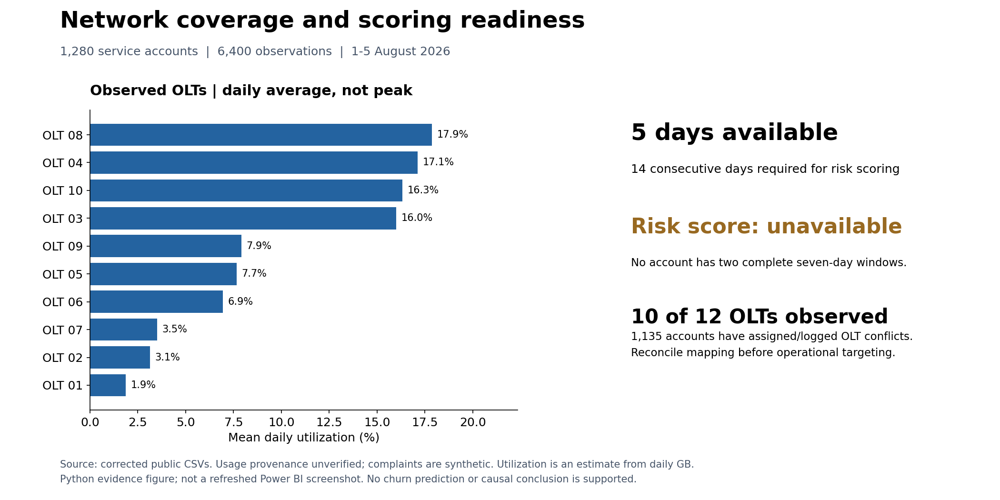

# Network Service Experience & Data Quality

Audit service experience, OLT mapping and coverage before making network or customer-risk decisions. The repository name and some `churn_*` fields are legacy compatibility names; the published sample does not support churn prediction.



*Reproducible Python figure; Power BI refresh remains pending.*

## Executive summary

The public sample contains **1,280 service-account keys**, **6,400 daily observations**, and **five dates (1-5 August 2026)**. Rebuilt daily-average utilization is **9.83% across 10 of 12 OLTs**. Full customer-risk scoring is **unavailable** because comparing separate seven-day usage windows requires fourteen days. This is a data-readiness and service-experience case study; no peak congestion, observed churn or retention improvement is established.

## Business questions

- What service-experience patterns need investigation?
- Which OLTs have daily usage coverage, and what does that coverage miss?
- Can complaint events be joined without using future information?
- Is there enough history to score changes in customer behavior?

## Findings and actions

| Finding | Evidence | Decision |
|---|---|---|
| Insufficient behavioral history | 0 of 6,400 rows have two complete seven-day windows | Collect at least fourteen consecutive days before full scoring |
| OLT assignments conflict | 1,135 accounts have logged/assigned OLT disagreement | Reconcile the source mapping before targeting interventions |
| Coverage is incomplete | 10/12 OLTs have observations | Obtain data for missing OLTs; do not treat absent data as healthy |
| Daily average is modest | 9.83% mean utilization; no peak measurements | Collect interval throughput before capacity decisions |
| Complaint leakage is unproven | 0 rule matches; complaints are synthetic | Demonstrate the rule without claiming support completeness |

The independent [data-readiness receipt](docs/data_readiness_receipt.json) quantifies the mapping conflict as **1,135/1,280 accounts (88.67%)**, identifies OLT **11 and 12** as absent from logged usage despite assigned accounts, and confirms that the maximum observed **daily-average** ratio is 17.98%. The source meaning of the mismatch is unknown; do not reassign accounts based on this comparison alone. See the [quality review and action order](docs/data_readiness_review.md).

## Data and privacy

Public tables use pseudonymous account IDs and omit direct contact identifiers. See [data authenticity](docs/data_authenticity.md): complaint events are generated; provenance of supplied usage/performance measurements is unresolved. Do not characterize the entire sample as verified real operations. Pseudonymization is not a guarantee against linkage.

## Method and KPIs

| KPI | Definition | Limit |
|---|---|---|
| Experience score | 0.5 speed score + 0.3 downtime score + 0.2 latency score | Analyst-defined thresholds |
| Daily utilization | GB * 8 / 86400 / capacity Gbps | Average, not peak congestion |
| Usage drop | (prior 7-day mean - current 7-day mean) / prior mean | Two complete, disjoint windows required |
| Complaint leakage | Experience <50 and zero as-of 30-day complaints | Simulated complaints |
| Customer risk score | Weighted five-signal rule | Blank with insufficient history; not churn prediction |

See [methodology](docs/methodology.md), [dictionary](docs/data_dictionary.md) and [model](dashboard/Data_Model.md). Customer/date and OLT/date facts join their dimensions one-to-many. Duplicate keys and invalid capacities fail the rebuild.

The five-day public sample is suitable for validating the pipeline and prioritizing source repairs. It is not suitable for publishing a high-risk customer count or claiming that a specific OLT caused poor service. If no longer, verified source data is obtained, keep the project focused on data quality and observed service experience.

## Reproduce from public data

```bash
python -m pip install -r requirements.txt
python scripts/03_build_metrics.py
python -m unittest discover -s tests -v
python scripts/render_overview.py
python scripts/validate_sql.py
python scripts/audit_public.py
```

The rebuild updates clean and Power BI CSVs together, plus samples and [verified metrics](docs/validated_metrics.json). No private source is needed. `01_clean_data.py` is optional private-source preparation; never commit those inputs. `02_generate_complaints.py` is the documented synthetic generator.

For a read-only clean-clone verification path that does not rewrite the Power BI input copies, use [REPRODUCE_PUBLIC.md](docs/REPRODUCE_PUBLIC.md). `audit_public.py` checks raw/derived grains, capacity-ratio arithmetic, OLT coverage and assignment conflicts with an independent SQLite reconciliation.

## Power BI report

Editable source: `dashboard/OLT_Professional_Project/OLT_Churn_Network_Risk_Professional.pbip`. Set the `DataRoot` Power Query parameter to the checkout's `dashboard/OLT_Professional_Project/data/` folder, including its final slash. Refresh and review the report in Power BI Desktop.

The old PBIX and screenshots were quarantined outside the repository because their risk counts predate the corrected metric definitions. A refreshed screenshot is pending; the source files are not claimed to have passed Desktop rendering tests. Legacy churn_* names and filenames are compatibility names only.

**Power BI validation remains pending:** Python, SQL and unit-test results do not prove DAX execution, slicer behavior or a current rendered report. No PBIP/TMDL/report files were changed during this data-readiness pass.

## Repository structure and skills

`data/clean/` holds public inputs and derived outputs; `scripts/` builds metrics; `tests/` covers edge cases; `sql/` contains executable SQLite analysis; `notebooks/` provides public EDA; `docs/` explains evidence and limits; `dashboard/` holds the editable Power BI model.

Skills: Python, pandas, SQL window functions, DAX, dimensional modeling, data-quality validation and business communication. No measured retention improvement, predictive accuracy or causal effect is claimed.
