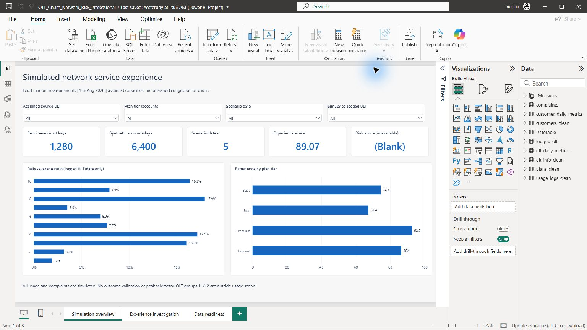

# Simulated Network Service Experience & Data Readiness

A Python, MySQL and Power BI portfolio demonstration of metric design, separate OLT roles, missing-history handling and reproducible data-quality checks.



## Data and scope

The author confirms that usage, speed, downtime and latency were generated with random Excel values because operational logs were unavailable. Ten OLT IDs, five dates (1–5 August 2026) and sequential customer IDs were chosen. The sample has **1,280 service-account keys and 6,400 synthetic account-days**. Complaints are separately generated synthetic events (805; seed 42). Plans and capacities are scenario assumptions.

Customer attributes derive from a confidential government-platform extract. Contacts, raw OLT addresses and exact activation dates remain private. Sequential IDs are frozen row labels, not stable customer identities. The original Excel random formulas/seed are unavailable: the frozen CSV analysis is reproducible, original random generation is not. [Simulation contract](docs/simulation_contract.md).

## Three strongest findings

1. **Zero complete 14-day windows**: the rule requires two complete, disjoint seven-day windows and positive prior usage. Full risk and high-risk share remain blank, never zero. Five dates cannot validate a churn predictor.
2. **1,135/1,280 assigned-versus-logged ID conflicts (88.67%)**: this is compatibility between source-derived groups and a separately generated simulation. It does not establish faulty provisioning or migration. The model keeps assigned and logged OLT dimensions separate.
3. **Ten simulated OLT IDs versus 12 source-address groups**: IDs 11/12 lie outside the chosen simulation scope. The scenario's mean daily-average ratio is **9.83%**, maximum **17.98%**, against assumed capacities. No peak telemetry or actual congestion is observed.

Experience averages 89.07 under analyst-defined thresholds; no business impact, retention improvement or predictive accuracy is claimed. Source comparison also found 71 synthetic account-days before original activation across 15 keys: arbitrary scenario chronology, not real pre-activation traffic.

## Implemented and executed

- Three-page editable [Power BI project](dashboard/OLT_Professional_Project/OLT_Churn_Network_Risk_Professional.pbip): Simulation overview, Experience investigation, Data readiness.
- Refreshed and saved in Desktop on **2 October 2026**; **133/133 native DAX checks** passed (19 measures across seven contexts). All three pages rendered; logged OLT slicer/reset matched independent totals. [Evidence and real screenshots](docs/powerbi_validation.md).
- **12 native MySQL 8.0.46 checks** passed, including calendar-window completeness, mapping conflicts, missing scores and GB/Gbps units. [Receipt](docs/mysql_validation.json).
- **15 Python tests** passed, covering window gaps, zero prior usage, future complaints, units, keys, source parsing, report copies and separate OLT roles.

The legacy repository/PBIP names and `churn_*` fields are retained for compatibility. This is a service-experience and data-readiness simulation, not observed churn prediction.

## Reproduce

```bash
python -m pip install -r requirements.txt
python scripts/03_build_metrics.py
python -m unittest discover -s tests -v
python scripts/validate_sql.py
python scripts/audit_public.py
python scripts/build_dax_validation.py
python scripts/configure_powerbi.py
```

Open the PBIP, refresh, apply pending changes, and run `docs/validate_measures.dax` in DAX query view. Expect Checks=133, Passed=133, empty Failures. [Clean-clone guide](docs/REPRODUCE_PUBLIC.md) and [MySQL commands](docs/sql_engine_notes.md).

The author used MySQL. SQLite checks are supplementary portable audits and are labeled separately. No private workbook or confidential portal is required for public reproduction. Do not commit `.pbi` caches or raw workbooks. Earlier history may retain legacy artifacts.

## Documentation and readiness

[Portfolio review](docs/portfolio_review.md) includes changed-file groups, before/after evidence, an interview story and the scoped **4/5 simulation/BI readiness assessment**. [Methodology](docs/methodology.md), [dictionary](docs/data_dictionary.md), [model/filter contract](dashboard/Data_Model.md), [authenticity](docs/data_authenticity.md) and [source reconciliation](docs/source_workbook_review.md) define the limits.

Real churn or congestion claims would require authentic longitudinal/interval measurements, stable source identities and validated outcomes. Those are unavailable and are not required for this clearly labeled simulation deliverable.
