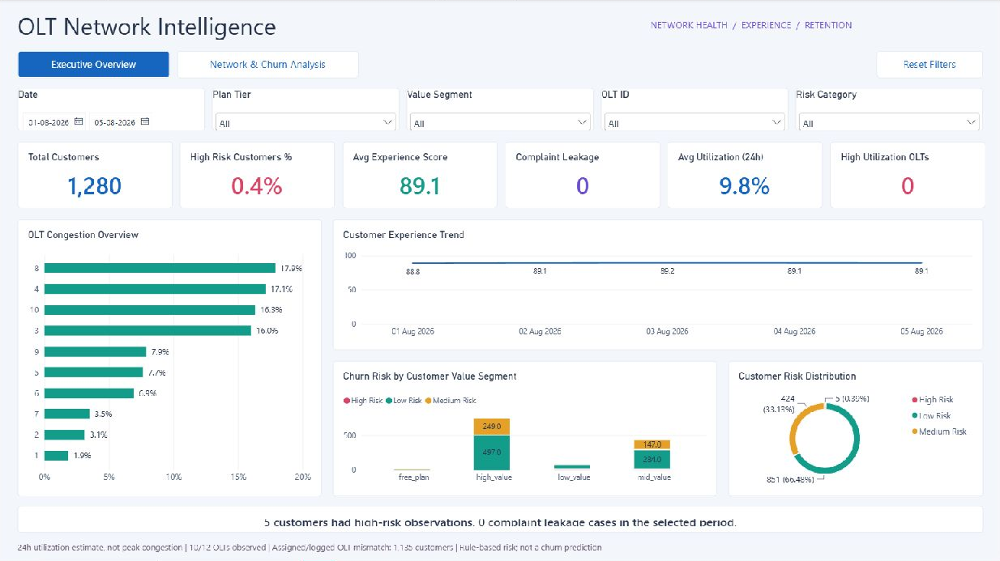
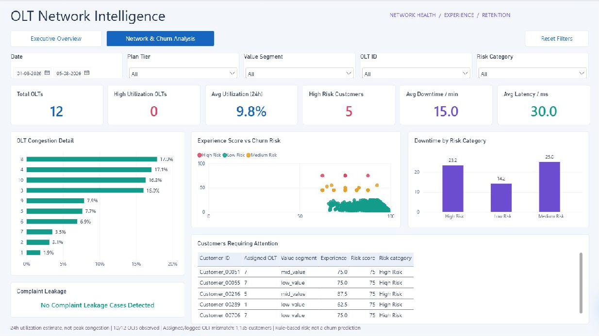

# OLT Churn & Network Risk Analytics Dashboard

## 1. Business Problem

An ISP needs a clear way to connect network experience, OLT congestion, silent complaints, and customer retention risk. Without this view, overloaded network areas and unhappy customers can stay hidden until churn has already happened.

Headline findings before dashboard slicers:

- Total customers analyzed: **1,280**
- High-risk customers: **5 (0.4%)**
- Average experience score: **89.1/100**
- Complaint leakage cases: **0**
- Average estimated 24-hour OLT utilization: **9.8%**, across **10 of 12 OLTs** with telemetry. Peak congestion is unavailable.

## 2. Project Objective

Build a telecom analytics report with an Executive Overview and Network & Churn Analysis page, supported by anonymized data, explainable risk metrics, and documented measurement limits.

## 3. Data Privacy

The original files contained customer names, mobile numbers, emails, full addresses, service numbers, staff names, and raw OLT IPs. These fields are removed or generalized in the clean dataset. Customer identifiers are replaced with `Customer_00001` format. Full addresses are reduced to area-level values only.

Raw data is withheld from the repository. See `data/raw/README.md` and `.gitignore`.

## 4. Data & Assumptions

The source data represents a small ISP/FTTH environment with customers, plans, daily usage logs, OLT metadata, and OLT traffic. Complaint records are simulated because complaint leakage requires examples of poor-service customers who may or may not complain.

This project does **not** claim to predict real churn. It creates a rule-based customer risk proxy using network and behavior signals.

## 5. Data Model

Core relationships:

- `plans_clean[plan_id]` to `customers_clean[plan_id]`
- `customers_clean[customer_id]` to `customer_daily_metrics[customer_id]`
- `customers_clean[customer_id]` to `complaints[customer_id]`
- `olt_info_clean[olt_id]` to `customers_clean[olt_id]`
- `olt_info_clean[olt_id]` to `olt_daily_metrics[olt_id]`

## 6. Tools Used

- Python: cleaning, complaint simulation, metric engineering, validation
- pandas and numpy: transformation and scoring
- Jupyter: EDA and light modeling notebook
- SQL: business-query proof layer
- Power BI: dashboard design and DAX plan

## 7. Methodology

1. Audit source files for PII.
2. Create anonymized clean tables at correct analytical grains.
3. Simulate complaint records for a controlled share of poor-service customers.
4. Build daily customer metrics and daily OLT congestion metrics.
5. Validate grains, keys, score ranges, joins, and headline KPIs.
6. Document SQL, Power BI measures, dashboard layout, and business insights.

## 8. Metrics & Formulas

### Congestion Ratio

`avg_gbps = (total_usage_gb * 8) / (24 * 3600)`

`congestion_ratio_percent = avg_gbps / capacity_gbps`

The Professional dashboard uses the validated rebuilt OLT facts under `dashboard/OLT_Professional_Project/data/`. The ratio is stored as a decimal and formatted as a percentage. This is a daily average utilization estimate, not peak congestion. The original clean OLT percentage fields are invalid for the dashboard.

### Experience Score

`experience_score = 0.5 * speed_score + 0.3 * downtime_score + 0.2 * latency_score`

### Usage Drop Percent

`usage_drop_percent = ((previous_7d_avg - current_7d_avg) / previous_7d_avg) * 100`

### Complaint Leakage

`complaint_leakage_flag = 1` when `experience_score < 50` and `complaint_count = 0`.

### Churn Risk Score

`30% usage drop + 25% downtime + 20% latency + 15% low experience + 10% complaint leakage`

Risk categories: `0-39 Low`, `40-69 Medium`, `70-100 High`.

## Dashboard

Working report: `dashboard/OLT_Churn_Network_Risk_Professional.pbix`. The original PBIX remains a rollback copy. The editable report/model project is under `dashboard/OLT_Professional_Project/`.

### Executive Overview

An executive view of customer churn exposure, experience quality, estimated network utilization, complaint leakage, and customer segment risk. Distribution charts count each customer once at their highest observed risk within the selected context.



### Network & Churn Analysis

Detailed OLT utilization, customer experience/risk relationships, downtime, complaint leakage status, and customers requiring attention. Downtime and latency contribute to the risk score; their association with risk is descriptive, not evidence of causality.



## 10. Key Insights & Recommendations

### Insight 1: OLT congestion

Finding: The prior extreme congestion values were invalid. Rebuilt telemetry averages 9.8% daily utilization; this does not establish peak-hour health.

Why it matters: Sustained congestion can lower speeds and increase latency for customers on that OLT.

Limitation: Daily customer usage was converted to an average throughput estimate; no peak throughput was supplied.

Recommendation: Obtain interval/peak throughput and resolve the assigned/logged OLT mismatch before making capacity investments. OLTs 11 and 12 lack daily telemetry.

Expected business impact: Better network experience and fewer customers moving into risk categories.

### Insight 2: Complaint leakage

Finding: 0 latest-date customer records show poor experience with no complaint record.

Why it matters: These customers may be dissatisfied but invisible to support workflows.

Interpretation: No supplied experience score falls below the leakage threshold. Zero cases do not demonstrate that complaint logging is complete; complaint records are simulated.

Recommendation: Create a proactive outreach list from `complaint_leakage_flag = 1`.

Expected business impact: Retention teams can contact silent-risk customers before churn.

### Insight 3: Usage drop

Finding: Usage drop contributes 30 points to the risk score and helps detect behavior changes before cancellation.

Why it matters: A sharp decline in usage may signal disengagement or unresolved service problems.

Likely reason: Reduced service quality, customer dissatisfaction, or changing customer need.

Recommendation: Review customers with `high_usage_drop_flag = 1` alongside OLT and complaint status.

Expected business impact: Better prioritization of retention outreach.

### Insight 4: Downtime impact

Finding: Downtime is one of the strongest service-quality risk signals, weighted at 25 points.

Why it matters: Outages create direct customer pain and can drive complaints or silent churn risk.

Likely reason: Local network instability, overloaded infrastructure, or unresolved field issues.

Recommendation: Track high-downtime customers by OLT and prioritize repeated offenders.

Expected business impact: Fewer avoidable escalations and improved customer experience.

### Insight 5: Latency impact

Finding: High latency contributes 20 points to the customer risk score.

Why it matters: Latency-sensitive activities like calls, video, gaming, and work apps can feel poor even when usage volume remains high.

Likely reason: Congestion or network routing/performance issues.

Recommendation: Add latency monitoring to the operational dashboard and investigate high-latency OLTs.

Expected business impact: Faster isolation of poor-experience zones.

### Insight 6: High-risk customer segment

Finding: The highest average latest-date risk score appears in `free_plan`.

Why it matters: Segment-level risk helps target retention offers and network actions.

Likely reason: Segment mix may combine high expectations, high usage, or greater sensitivity to service degradation.

Recommendation: Compare risk by value segment in Power BI before campaign design.

Expected business impact: More focused customer retention spend.

## 11. SQL Analysis

Business SQL queries are stored in `sql/queries.sql`, including joins, risk grouping, rolling averages, OLT ranking, complaint leakage, and KPI validation.

## 12. Python Analysis

Runnable scripts:

- `scripts/01_clean_data.py`
- `scripts/02_generate_complaints.py`
- `scripts/03_build_metrics.py`

Notebook:

- `notebooks/eda_and_modeling.ipynb`

## 13. How to Reproduce

1. Create a local virtual environment.
2. Install requirements: `pip install -r requirements.txt`
3. Place private raw source files in `data/raw/`.
4. Run `python scripts/01_clean_data.py`
5. Run `python scripts/02_generate_complaints.py`
6. The original `scripts/03_build_metrics.py` depends on private raw OLT traffic and is not the Professional report build path. Use the validated Professional project datasets for the dashboard.
7. Open `notebooks/eda_and_modeling.ipynb` for EDA and light modeling.
8. Open the Professional PBIP, refresh, and save as the Professional PBIX. The original clean sources remain unchanged. The DateTable currently covers the supplied five days and must be extended when adding history.

## 14. Project Structure

```text
olt-churn-analytics/
├── README.md
├── data/
│   ├── raw/
│   │   └── README.md
│   ├── clean/
│   └── sample/
├── scripts/
├── sql/
├── notebooks/
├── dashboard/
│   └── screenshots/
├── docs/
├── requirements.txt
└── .gitignore
```
